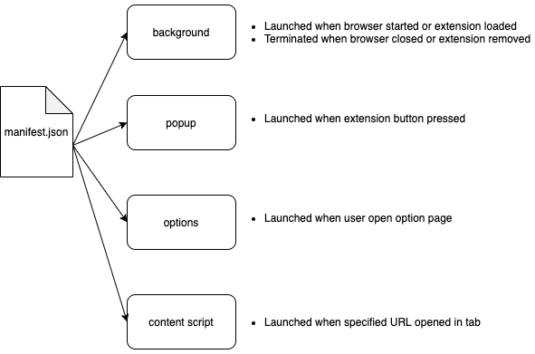

<h3>How To Setup</h3>

Step 1: Git Clone or Download the folder (if you download as a Zip file, be sure to unzip it before moving to the next step)

Step 2: Navigate to your <a href="chrome://extensions">Chrome Extensions Tab</a>

Step 3: Click the "Developer Mode" switch (on the top right of the screen) (should be enabled)

Step 4: Click "Load Unpacked" button. Choose the directory of the unzipped folder (the manifest.json file should be in the root directory chosen).

Step 5: Visit <a href="amazon.com">https://www.amazon.com</a>, and open your Dev Console. You should see the text 'content script ran' logged in your dev console. 

Step 6: If/when you add a Background.js page, visit your <a href="chrome://extensions">Chrome Extensions Tab</a> again, and find the new Extension you just uploaded. Click the "background.html" link - this will give you a Chrome developer tools GUI to view what's happening in the "background.js" of your Chrome Extension.

<h3>Chrome Extension Structure</h3>



<h3>Best Practices: Make Post Requests from the Background (not Content Page)</h3>

Most sites have triggers that listen for when external apps are making post requests directly from the DOM (i.e. the Content.js page). As a Chrome Extension developer, you have the most privacy from the 'popup.js' page, and the 'background.js' pages, because popup.js and background.js are part of the Chrome Browser's Internal Structure.

Here's a code example of how the communication between background.js and content.js might look like:


Content.js:
```javascript
chrome.runtime.sendMessage({type: "imageData", images: stuffToSave});
```

And here's how to listen for a message from the Popup.js, or Background.js:
```javascript
chrome.runtime.onMessage.addListener(
        function(message, sender, sendResponse) {
            switch(message.type) {
                case "imageData":
                    console.log('got image Data from content.js: ', message)

```


Because the chrome.runtime.onMessage API goes out to the content.js, background.js, and popup.js pages, Chrome Extension developers frequently use the JavaScript switch statement when listening for these events.

You can use the following template in any of your main extension pages:

```javascript
chrome.runtime.onMessage.addListener(
        function(message, sender, sendResponse) {
            switch(message.type) {
            	case x:
		    // code block
		    break;
		case y:
		    // code block
		    break;
		default:
		    // code block
            }
        }
);
```

<h3>Messaging: Important Note</h3>

'if you're debugging your extension and the Dev Tools window is open and focused, the array will be empty. You should check for that.'

<a href='https://stackoverflow.com/questions/29681477/background-script-messaging-with-javascript'>source</a>
